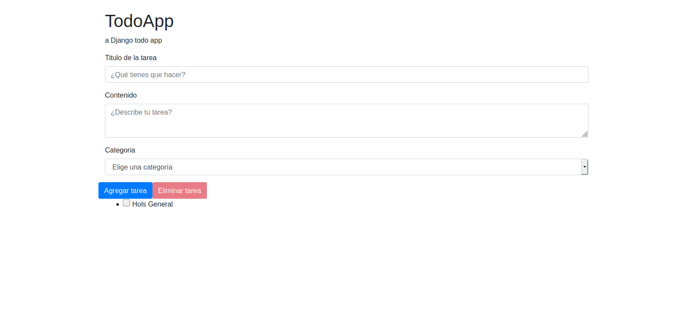
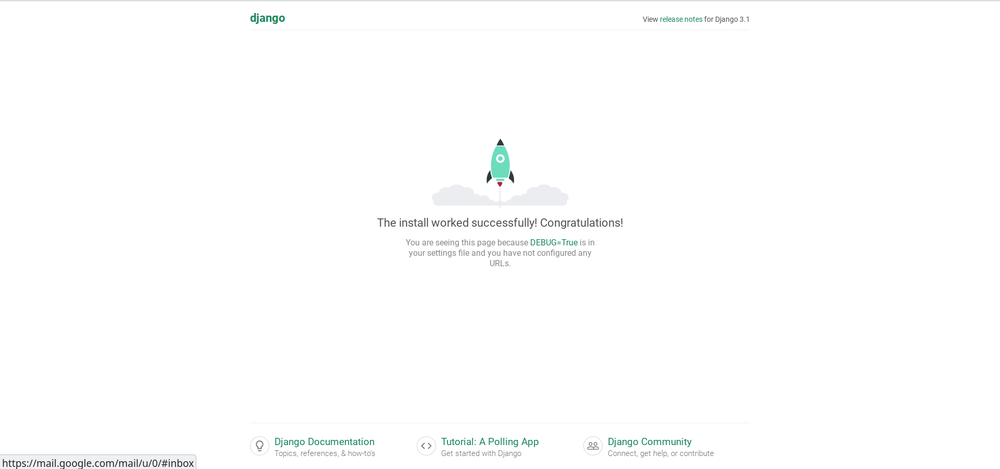
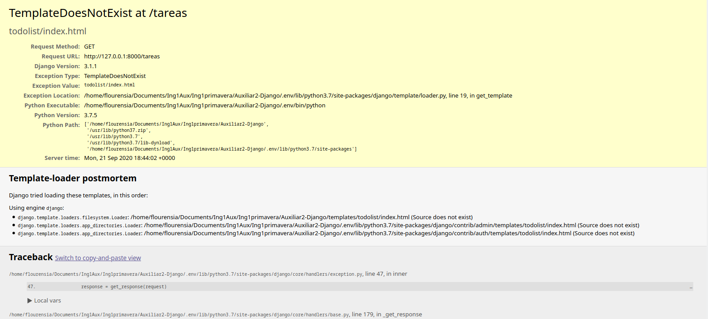

# Auxiliar 1: Django

En esta auxiliar crearás una aplicación web que permitirá mostrar una lista de tareas. 
Estas tareas tendrán una categoría que luego podrían servir para hacer algún filtro. 
La información de las categorías viene pre-hecha y la base de datos ya contiene algunas categorías. 

La aplicación tendrá una sola página y se verá así: 


## Configuración del Ambiente de Trabajo
El primer paso en esta auxiliar será crear un ambiente virtual donde estará toda la configuración de Python para este proyecto en específico. 

Un entorno virtual aísla tu configuración de Python/Django para cada proyecto. 

Primero queremos encontrar un directorio en el que quieras crear el entorno virtual (o *virtualenv*). Puede ser en tu directorio home (/home/Name en Linux o en C:\Users\Name en Windows, donde 'Name' es tu nombre de usuario).

> En windows, asegurate que tu directorio no contiene caracteres especiales o acentuados.

Para este tutorial usaremos un nuevo directorio `cc4401-aux` en tu directorio home.

```
$ mkdir cc4401-aux
$ cd cc4401-aux
```

Crearemos entonces el ambiente virtual llamado `auxiliar`. El comando para ello es:

```
$ python -m venv auxiliar
```

> Su ambiente virtual debe estar en minúsculas y no contener espacios.

El comando anterior creará un directorio llamado `auxiliar` que contiene el entorno virtual (muchos archivos y carpetas).

Ahora deberás iniciar el entorno virtual ejecutando para Windows:

```
C:\Users\Name\cc4401-aux> auxiliar\Scripts\activate
```

Y para Linux:

```
$ source auxiliar/bin/activate
```

Sabŕas que tienes tu ambiente virtual iniciado cuando veas que en la línea d comando en tu consola tiene el prefijo `(auxiliar)`

Ahora que tenemos nuestro entorno virtual iniciado, podemos instalar las dependencias de nuestro proyecto, pero antes de eso, debemos aseguirarnos de tener la última versión de pip, el software que utilizamos para instalar Django:

```
(auxiliar) ~$ python -m pip install --upgrade pip
```

Ya estaría todo listo para continuar con el siguiente paso.

> Instrucciones más detalladas de esta parte del tutorial fueron sacadas de [este tutorial](https://tutorial.djangogirls.org/es/django_installation/).

## Descargar e Instalar TODO Project 
En la auxiliar de hoy no vas a comenzar un proyecto de Django desde 0 
sino que usarás un proyecto que ya está configurado con lo básico para crear la aplicación web de tareas.   

1.  La primera tarea es hacer Fork y Clone de este mismo repositorio. 
    > Si no recuerdas cómo hacerlo puedes revisar la [auxiliar de GIT](https://github.com/Aux-Ing-1/Auxiliar1-GIT). 
2.  Para entrar a la carpeta donde está el proyecto hay que hacer `cd Auxiliar1-Django` en la consola. 
3. 
    Para poder utilizar esta app hay que instalar los paquetes que el proyecto requiere. 
    Para esto instalaremos la lista de paquetes que viene en el archivo `requirements.txt` con el siguiente comando (RECUERDA TENER EL AMBIENTE VIRTUAL ACTIVO): 
    ```
    (auxiliar) pip install -r requirements.txt
    ```
4. 
    El project de Django trae algunas tablas de la base de datos pre hechas, 
    por lo tanto tenemos que avisarle que actualice sus tablas con el siguiente comando: 
    ```
    (auxiliar) python manage.py migrate
    ``` 
5.
    Habiendo configurado el proyecto en tu computador deberías poder acceder a la aplicación web con el siguiente comando:
    ```
    (auxiliar) python manage.py runserver
    ```   
    Al entrar a `http://127.0.0.1:8000/` deberías ver lo siguiente:  

5. 
    La estructura de las carpetas debería quedar así:
    ``` 
    Auxiliar2-Django
    ├───manage.py
    ├───TODOproject
    │   │ settings.py
    │   │ urls.py
    │   │ wsgi.py
    │   │ __init__.py
    ├───categorias  
    ├───db.sqlite3
    ├───README.md
    └───requirements.txt 

    ```    

    > De aquí en adelante vamos a obviar que están en el ambiente virtual, por lo que no aparecerá (auxiliar) en los comandos.
          
## Crear una nueva app: todoapp 
Como se explicó en la clase, Django está compuesto por apps que forman las diferentes partes de la aplicación web. 
Para esta auxiliar solo haremos una app con toda la funcionalidad. Esta se llamará **todoapp**. 

1. **Crear la app**

    Lo primero será crear la app. Para eso haremos el siguiente comando en la consola: 
    ```
   python manage.py startapp todoapp
   ```
   > Dato: se recomienda que en el nombre de la app solo hayan minúsculas, 
   >y se puede utilizar _ para hacer el nombre más legible.  
   >Para más guías de estilo para python puedes revisar [PEP 8](https://www.python.org/dev/peps/pep-0008/)
    *  
        La estructura de las carpetas debería quedar así:
        ```
        Auxiliar2-Django
        ├───manage.py
        ├───TODOproject
        │   ├───settings.py
        │   ├───urls.py
        │   ├───wsgi.py
        │   ├───__init__.py
        ├───todoapp
        │   ├───admin.py
        │   ├───apps.py
        │   ├───models.py
        │   ├───tests.py
        │   ├───views.py
        │   ├───__init__.py
        ├───db.sqlite3
        ├───categorias  
        ├───README.md
        └───requirements.txt 
        ```                                                                                                                                                                
2. **Agregar la app a installed_apps**

    Para que el project sepa que existe esta nueva app hay que agregarla a `installed_apps` en el archivo `settings.py` de `TODOproject`. 
    
    Primero tienes que importar la app al inicio del archivo `settings.py` así: 
       
    `import todoapp`
    
    Y luego agregarla a la variable `installed_apps` para que quede así:
    ```
   INSTALLED_APPS = [
    'django.contrib.admin',
    'django.contrib.auth',
    'django.contrib.contenttypes',
    'django.contrib.sessions',
    'django.contrib.messages',
    'django.contrib.staticfiles',
    'categorias',
    'todoapp',
    ]
   ```        
3. **Crear Modelo Tarea**
    Para crear la aplicación de lista de tareas debemos crear un *modelo* 
    que defina la información que guardaremos sobre cada Tarea.
    
    Los modelos se guardan en el archivo *todoapp/models.py*.
    En este caso crearemos un modelo llamado Tarea que tendrá un *título*, *contenido*, *fecha de creación* y *categoría*.
    La categoría será una llave foránea al modelo Categoría de la app categorías (que venía pre hecha).  
    
   * El primer modelo que crearás es el modelo Tarea con todos sus atributos, para esto copia el siguiente código en `todoapp/models.py`:
        ```python
        from django.db import models
        from django.utils import timezone
        from categorias.models import Categoria

        class Tarea(models.Model):  # Todolist able name that inherits models.Model
            titulo = models.CharField(max_length=250)  # un varchar
            contenido = models.TextField(blank=True)  # un text
            fecha_creación = models.DateField(default=timezone.now().strftime("%Y-%m-%d"))  # un date
            categoria = models.ForeignKey(Categoria, default="general", on_delete=models.CASCADE)  # la llave foránea

            def __str__(self):
                return self.titulo  # name to be shown when called
        ```
   
        .
        > La clase Tarea hereda de models.Model para tener todas las características de un model de Django. 
    
        > El atributo título será un CharField con un largo máximo de 250 caracteres. [Aquí](https://docs.djangoproject.com/en/3.1/ref/models/fields/#field-types)  hay mas información sobre Fields.  
    
        > En este modelo utilizamos atributos de diferentes tipos como texto y fechas. 
           
        > La variable blank=True en el atributo `contenido` indica que este atributo puede estar en blanco. 
    
        > La variable default = ... en el atributo `fecha_creacion` indica que si no se entrega una fecha de creación, por defecto se pondrá la fecha actual.   
    
        > Para crear una llave foránea utilizamos `models.ForeignKey` y hay que entregar el modelo que será la llave foránea y una opción de `on_delete`. [Información sobre on_delete](https://docs.djangoproject.com/en/3.1/ref/models/fields/#django.db.models.ForeignKey.on_delete)  
    
        > El método _ _ str_ _ permite definir cómo se mostrará una categoría al imprmirla. 
   
   * El siguiente paso es agregar este modelo a la base de datos del proyecto. Para esto hay que seguir dos pasos: crear las migraciones y migrar.
    
        >Según la documentación oficial "Las migraciones son la forma que tiene Django de propagar cambios que le hacemos a los modelos hacia la base de datos". 
        
        Para hacer esto pondremos los siguientes comandos en la terminal: 
        ```
        python manage.py makemigrations
        python manage.py migrate
       ```
       Después de hacer estos dos comandos puedes ver que la carpeta *todoapp/migrations* tiene un nuevo archivo, 
       con todos los cambios que hiciste a los modelos. 
     
    No agregaremos elementos a la base de datos aún, sino que seguiremos creando la aplicación para ver la lista de tareas. 
  4. **Crear URLs**
     
     Como vimos en la primera parte de la clase, las URLs determinan "por donde se puede entrar" a la aplicación web, es por esto que será lo siguiente que vamos a crear. 
    
        * Lo primero que harás es hacer que las URLs de la todoapp queden disponibles en todo el project. 
            Para esto, debes ir al archivo *TODOproject/urls.py* y agregar la siguiente linea de código en la lista de `url_patterns`:
            ```python
            path('', include('todoapp.urls'))
            ```  
          También debes incluir el método `include` en el archivo, para esto agrega la siguiente línea al inicio de *TODOproject/urls.py*: 
            ```python
          from django.urls import include
            ```    
        * Ahora hay que crear las URLs de la todoapp. Lo que harás es crear una URL para que cuando alguien ingrese a 
        `127.0.0.1:8000/tareas` pueda ver sus tareas. 
            
            Para esto hay que crear un archivo llamado `urls.py` en la carpeta `todoapp`. En este archivo escribirás el siguiente código: 
            ```python
            from django.urls import path
            from . import views

            urlpatterns = [
                path('tareas', views.tareas, name='mis_tareas'),
            ]         

            ```  
            El método `path` hará un mapeo entre el patrón de la URL,
         *en este caso 'tareas'*, con el método `tareas` de views.py, para saber qué hacer cuando alguien ingrese a esta URL. 
                
5. **Crear Views** 

    En el paso anterior creaste una URL 'tareas' que está "mapeada" con el método tareas de views.py. 
    Es por esto que ahora crearás este método para que cargue una interfaz que muestra todas las tareas guardadas. 
    
    En el archivo *todoapp/views.py* tendrás que pegar este código que explicaremos luego: 
    ```python
    from django.shortcuts import render, redirect

    # Create your views here.
    from todoapp.models import Tarea
    from categorias.models import Categoria


    def tareas(request): #the index view
        mis_tareas = Tarea.objects.all()  # quering all todos with the object manager
        categorias = Categoria.objects.all()  # getting all categories with object manager

        if request.method == "GET":
            return render(request, "todoapp/index.html", {"tareas": mis_tareas, "categorias": categorias})

    ```
   Los métodos de las views siempre deben recibir una request, porque ahí se encuentra la información de la request HTTP.
   
   En este caso, la view tendrá una variable tareas que tendrá todas las tareas de la base de datos. 
   Y otra variable categorias que tendrá todas las categorías de la base de datos. 
   >En la próxima auxiliar estudiaremos un poco más en detalle cómo acceder a elementos de la base de datos. 
   
   Como estamos cargando la página, la request que la aplicación recibe es de tipo GET, 
   y queremos que al recibir una request de este tipo se haga render de la página, es decir, se muestre la página de tareas.  
   
   El último parámetro del método `render` es un diccionario con toda la información que la view le entregará al template que vamos a cargar (que en este caso aún no existe). 

6. **Recapitulemos** 
    
   Hasta ahora hemos creado *el modelo* Tarea,
    *una URL* llamada *tareas*, y 
    *una view* que permite hacer render de un template (que aún no creamos) 
    y le entrega las tareas y categorías de la base de datos al template.
    
    Para comprobar que no tenemos errores en este paso tendrás que correr la aplicación y entrar a la URL *tareas*. 
    Para esto en la consola debes hacer `python manage.py runserver` y entrar al link `127.0.0.1:8000/tareas`. 
    
    Como aún no creamos un template llamado *index.html* deberías ver lo siguiente: 
    
    
    
7. **Creación del Template**
    
    Ahora vamos a crear el template para mostrar todas las tareas.
    * Lo primero que hay que hacer es crear una carpeta llamada templates dentro de todoapp. 
    
        Después, hay que crear una carpeta llamada todoapp, dentro de la carpeta templates que recién creamos. 
        
        Esto lo hacemos así para distinguir entre las diferentes carpetas de templates de las diferentes aplicaciones que puede tener un mismo projecto Django. 
        
        Finalmente hay que crear un archivo vacío llamado `index.html` en la carpeta todoapp/templates/todoapp/.
        
        Al final de este paso las carpetas deberían quedar así:
         ```
        Auxiliar2-Django
        ├───manage.py
        ├───TODOproject
        │   settings.py
        │   urls.py
        │   wsgi.py
        │   __init__.py
        ├───todoapp
        │   ├───migrations
        │   │   001_initial.py
        │   ├───templates
        │   │   ├───todoapp
        │   │      index.html
        │   admin.py
        │   apps.py
        │   models.py
        │   tests.py
        │   views.py
        │   urls.py
        │   __init__.py
        ├───db.sqlite3
        ├───README.md
        └───requirements.txt 
        ```   
        Ahora si corres la aplicación y entras a `127.0.0.1:8000/tareas` deberías ver una página en blanco.  
  
    * Ahora tenemos que escribir el código para que al abrir la aplicación web se pueda ver la lista de tareas existentes y poder agregar una nueva tarea. 
    
        Para esto tendrás que agregar el siguiente código al archivo *todoapp/templates/todoapp/index.html*: 
        ```html
        <!DOCTYPE html>
        <html >
          <head>
              <meta charset="UTF-8">
              <title>TodoApp - Create A Todo With Django</title>
              <link rel="stylesheet" href="https://stackpath.bootstrapcdn.com/bootstrap/4.5.2/css/bootstrap.min.css" integrity="sha384-JcKb8q3iqJ61gNV9KGb8thSsNjpSL0n8PARn9HuZOnIxN0hoP+VmmDGMN5t9UJ0Z" crossorigin="anonymous">
          </head>
          <body>
              <div class="container" style="margin-top: 2em">

                  <!-- Encabezado de la página-->
                  <h1>TodoApp</h1>
                  <p class="tagline">a Django todo app</p>
                  <!-- Fin encabezado -->
                  <form action="" method="post">
                       <!-- csrf token for basic security -->
                      <!-- Formulario de nueva tarea-->
                      <div class="form-group">
                          <label for="titulo">Titulo de la tarea</label>
                          <input type="text" id="titulo" class="form-control" placeholder="¿Qué tienes que hacer?" name="titulo" required>
                      </div>
                      <div class="form-group">
                          <label for="contenido">Contenido</label>
                          <textarea  id="contenido" class="form-control" placeholder="¿Describe tu tarea?" name="contenido" required></textarea>
                      </div>
                      <div class="form-group">
                          <label for="categoria">Categoria</label>
                          <select id="category"  class="form-control" name="selector_categoria">
                              <option class="disabled" value="">Elige una categoría</option>
                              
                                  <option class="" value="{{ categoria.nombre }}" name="{{ categoria.nombre }}">{{ categoria.nombre }}</option>
                              
                          </select>
                      </div>
                      <!-- Fin formulario de nueva tarea -->
                      <!-- Botones para agregar o eliminar tarea -->
                      <div class="row">
                          <button class="btn btn-primary" name="taskAdd" type="submit"><i class="fa fa-plus icon"></i>Agregar tarea</button>
                          <button disabled class="btn btn-danger" name="taskDelete" formnovalidate="" type="submit" onclick="$('input#sublist').click();"><i class="fa fa-trash-o icon"></i>Eliminar tarea</button>
                      </div>
                      <!-- Fin botones para agregar o eliminar tarea -->
                      <!-- Lista de las tareas existentes -->
                      <ul class="list-group">
                        <!-- django template lang - for loop -->
                           <li class="list-group-item">
                               <input type="checkbox" class="taskCheckbox" name="checkedbox" id="{{ tarea.id }}" value="{{ tarea.id }}">
                               <label for="{{ tarea.id }}"><span class="complete-"><b>Título: </b>{{ tarea.titulo }}</span></label>
                               <span class="categoria-{{ tarea.categoria }}"><b>Categoría: </b>{{ tarea.categoria }}</span>
                           </li>
                       
                   </ul>
                      <!-- Fin de la lista de tareas existentes-->
                  </form>
              </div><!-- container -->

              <script src="https://ajax.googleapis.com/ajax/libs/jquery/3.2.1/jquery.min.js"></script>
          </body>
        </html>
        ``` 
      En otra clase auxiliar se estudiará en profundidad los contenidos de HTML y CSS necesarios para trabajar con los templates. 
      
      Por ahora es importante notar que hay código escrito entre doble llave `{{variable}}` 
      y otras partes del código escritas así: ``.
      Esta es la sintaxis de los templates de Django que permite acceder a las variables que la view le envía al template,
      y usar algunas operaciones simples como condiciones y ciclos, entre otras. 
      Para más información puedes leer [aquí](https://docs.djangoproject.com/en/3.1/topics/templates/#the-django-template-language). 
      
    * Ahora si corres la aplicación web y entras a `127.0.0.1:8000/tareas` deberías ver el formulario para crear una tarea. 
    
        >Las categorías que aparecen ahí fueron creadas en el proyecto original que descargaste. Al final de la auxiliar podrás ver cómo editarlas y agregar nuevas.  
    
        >Por otro lado, no le hemos indicado al proyecto qué hacer cuando se seleccione el botón agregar tarea, por lo tanto al agregar una tarea aparecerá un error. 

    7.1 **Entender Formulario HTML**
   
    A continuación se encuentra la estructura que tiene un formulario HTML y para qué sirve cada línea. 
    Es importante tener una noción de cómo funcionan estos formularios para entender cómo procesarlos en `views.py`.
    ```html
       <form action="" method="post"> <!-- Inicio del form, la información se enviará por POST -->
            <!-- csrf token para seguridad -->
           <div class="form-group"> <!--div solo sirve para estructurar información, no aporta funcionalidad -->
               <label for="description">Descripción</label> <!-- Label será la etiqueta que aparece al lado de un elemento del formulario --> 
               <!-- Input representa un elemento donde la persona ingresa información, es muy importante el name, porque este será la llave para acceder a la información del form en la view.  -->  
               <input type="text" id="description" class="form-control" placeholder="¿Qué tienes que hacer?" name="descripcion" required>     
           </div>
           <button class="btn btn-primary" name="taskAdd" type="submit">Agregar tarea</button> <!-- Este botón sirve para enviar el formulario ya que es de tipo submit. El campo class solo indica el estilo que tendrá el botón -->
       </form>
    ```
        
8. **Agregar Tarea en views.py**  
    
    El template que creaste en el paso anterior contiene un formulario para agregar nuevas tareas, 
    así que en este paso vas a crear el código para que esto funcione. 
    
    Para cargar la página se utilizó el método `tareas` de `views.py` y para recibir el formulario se utilizará el mismo método. 
    En general, los formularios se envían por POST, por lo tanto en el método `tareas` podremos tomar la información del formulario solo si `request.method=="POST"`. 
    
    Ahora crearás un código que verifica si la request fue de tipo POST 
    y luego tomará el título, el contenido y la categoría que vienen en el formulario para crear una nueva Tarea en la base de datos. 
    
    Para obtener a la información del formulario tienes que acceder a `request.POST` que será un diccionario como el que está a continuación: 
    ```json
     {
       "csrfmiddlewaretoken": ["uncodigosecreto"], 
       "titulo": ["mi super tarea"], 
       "contenido": ["Tengo que preparar la auxiliar para el miercoles"], 
       "selector_categoria": ["auxiliar"], 
       "taskAdd": [""]
   }
   ```
    
    Agrega este código al método `tareas` de `todoapp/views.py`:
    ```python
    if request.method == "POST":  # revisar si el método de la request es POST
        if "taskAdd" in request.POST:  # verificar si la request es para agregar una tarea (esto está definido en el button)
            titulo = request.POST["titulo"]  # titulo de la tarea
            
            nombre_categoria = request.POST["selector_categoria"]  # nombre de la categoria
            categoria = Categoria.objects.get(nombre=nombre_categoria)  # buscar la categoría en la base de datos
            
            contenido = request.POST["contenido"]  # contenido de la tarea
            
            nueva_tarea = Tarea(titulo=titulo, contenido=contenido, categoria=categoria)  # Crear la tarea
            nueva_tarea.save()  # guardar la tarea en la base de datos.
   
            return redirect("/tareas")  # recargar la página.

    ```
    En el código anterior si la request es POST y la persona seleccionó *Agregar tarea*, 
    se tomará cada valor que venía en el formulario y se creará la nueva tarea. 
    
     > Es importante destacar que en el código hay una variable llamada `nombre_categoria` y otra llamada `categoria`, 
    la primera será el valor que se envía en el formulario y corresponde al nombre de la categoría ya que así lo definimos al poner `value="{{ categoria.name }}"` en las opciones del form: 
     
     > `<option class="" value="{{ categoria.name }}" name="{{ categoria.name }}">{{ categoria.name }}</option>`
     
     > La segunda corresponde a una instancia del modelo Categoria, que será la llave foránea de nuestra nueva Tarea. 
    
9. **Probar la Aplicación** 
    
    Ahora si corres la aplicación con `python manage.py runserver` y entras a `127.0.0.1:8000/tareas` verás la aplicación web funcionando 
    y podrás agregar tareas.  
    
## Extra: Acceder al admin de Django
En `todoapp/admin.py` registrar los modelos con el siguiente código: 
```python
from todoapp.models import  Tarea

admin.site.register(Tarea)

```

En la consola hacer: `python manage.py createsuperuser` y crear un superusarix que podrá acceder al panel de administrador y editar elementos de la base de datos. 


Finalmente correr la aplicación web y entrar a 127.0.0.1:8000/admin y loguearse con la cuenta recién creada. 
